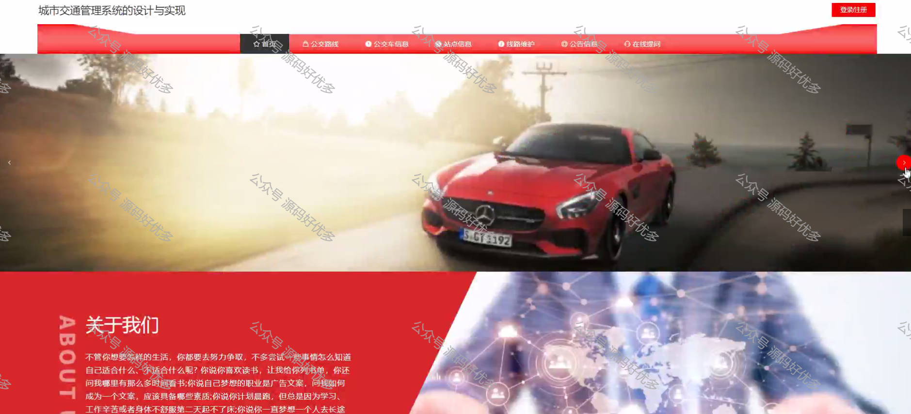
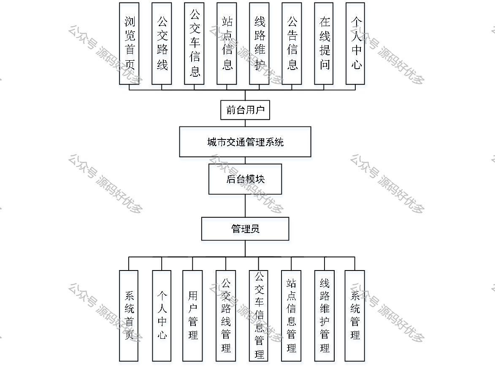
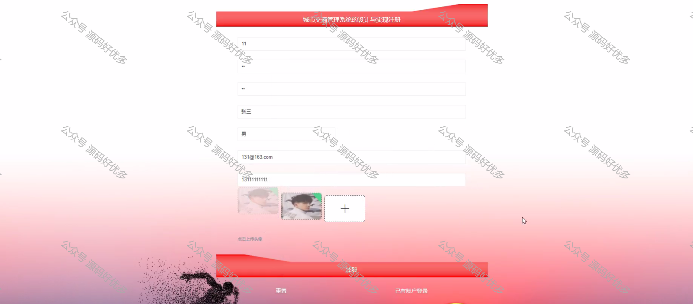
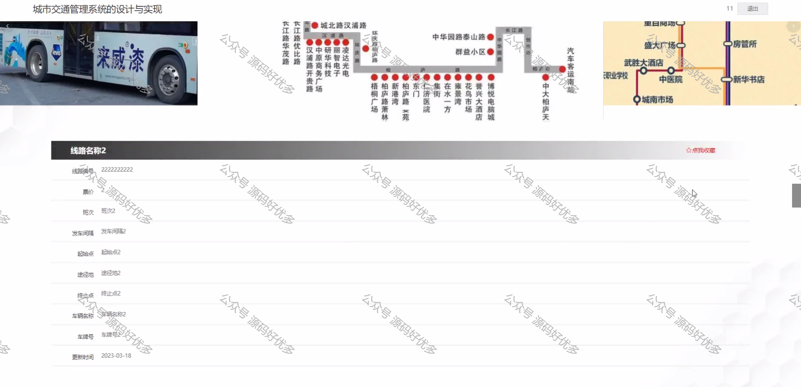
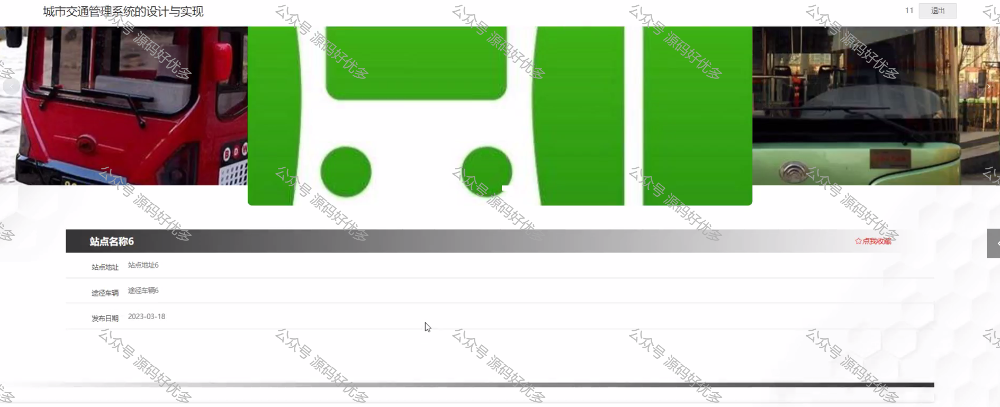
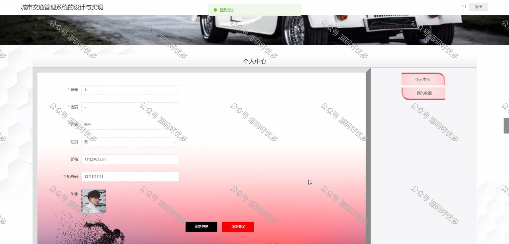
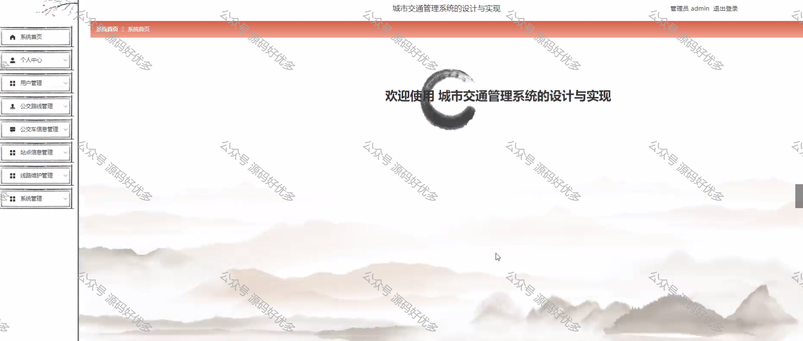
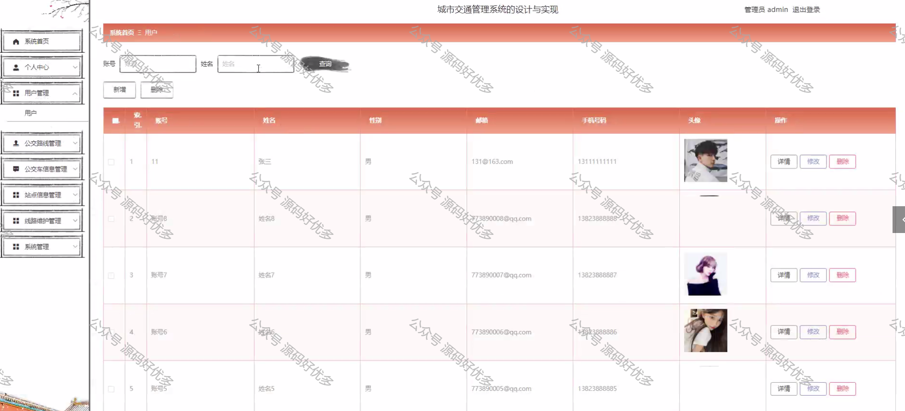
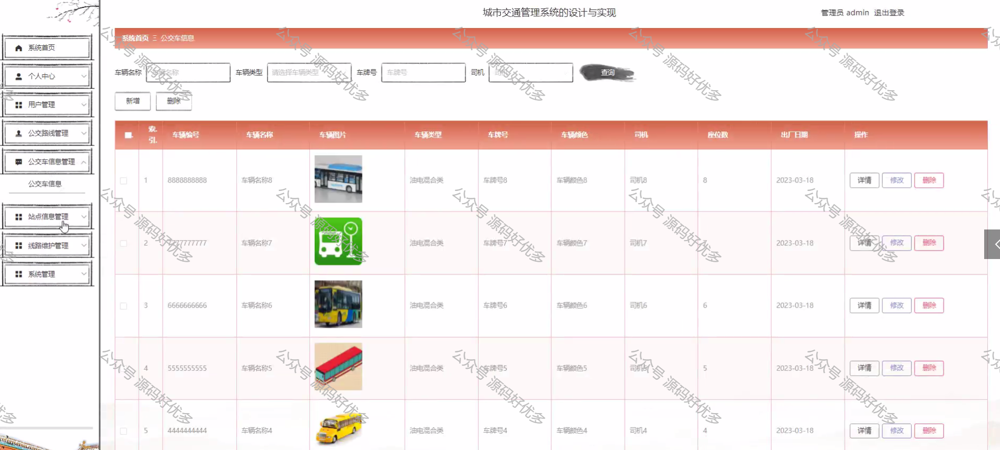

 
## 查看主页获取源码

> **作者介绍**： **✌**全网粉丝10W+本平台特邀作者、博客专家、CSDN新星计划导师、java领域优质创作者,博客之星、掘金/华为云/阿里云/InfoQ等平台优质作者、专注于项目实战 **✌**

  

### 一、作品包含

源码+数据库+设计文档万字+PPT+全套环境和工具资源+部署教程

### 二、项目技术

前端技术：Html、Css、Js、Vue、Element-ui

数据库：MySQL

后端技术：Java、Spring Boot、MyBatis

  

### 三、运行环境

开发工具：IDEA/eclipse

数据库：MySQL5.7

数据库管理工具：Navicat10以上版本

环境配置软件： JDK1.8+Maven3.6.3

前端Nodejs：14

  

### 四、项目介绍
项目编号：springbootA072

城市交通管理系统的目的是让使用者可以更方便的将人、设备和场景更立体的连接在一起。能让用户以更科幻的方式使用产品，体验高科技时代带给人们的方便，同时也能让用户体会到与以往常规产品不同的体验风格。
与安卓，iOS相比较起来，城市交通管理系统在流畅性，续航能力，等方方面面都有着很大的优势。这就意味着城市交通管理系统的设计可以比其他系统更为出色的能力，可以更高效的完成最新的公交路线、公交车信息、站点信息等功能。

### 五、运行截图

  
